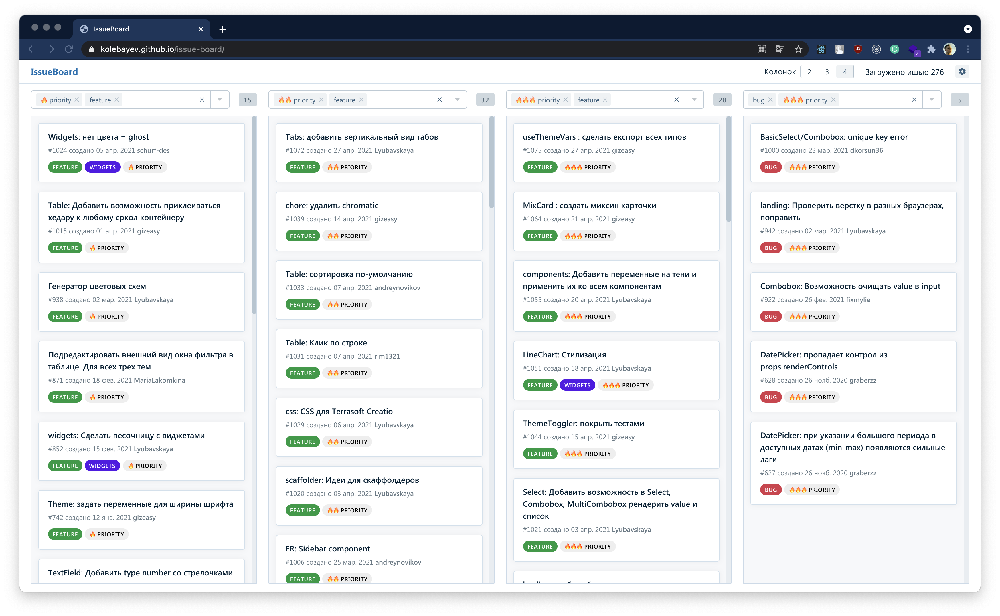

# Issue Board

> [DEMO](https://kolebayev.github.io/issue-board/)

Issue Board — приложение для просмотра issue в открытых репозиториях GitHub.

## Фичи

- получение списка issue (необходим [токен Github](https://docs.github.com/en/github/authenticating-to-github/creating-a-personal-access-token))
- фильтрация по лейблам
- возможность отображения данных в несколько колонок

По умолчанию включен репозиторий [дизайн-системы Consta](http://consta.gazprom-neft.ru/)

## Сетап

[Create React App](https://github.com/facebook/create-react-app) + [дизайн-система Consta](http://consta.gazprom-neft.ru/)
